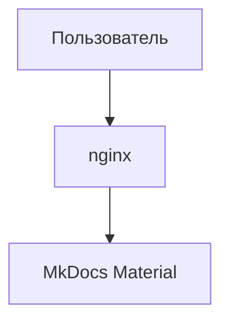

# Продвинутые элементы

## Вкладки

=== "Python"
    ```python
    print("Hello from Python")
    ```

=== "Bash"
    ```bash
    echo "Hello from Bash"
    ```

## Скрывающиеся блоки

<details>
  <summary>Показать детали</summary>

  Это можно скрыть под спойлером.

</details>

## Задачи

- [x] Сделать документацию
- [ ] Написать API

## Диаграмма (Mermaid)



## Формулы (MathJax)

$$
E = mc^2
$$
